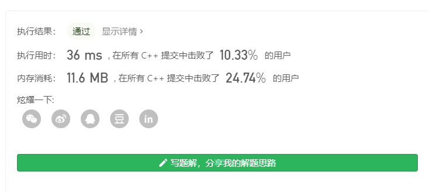
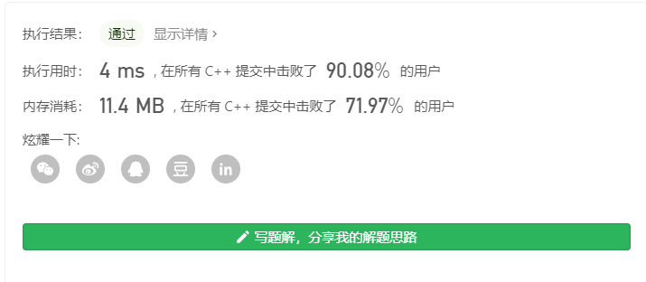

## 107. 二叉树的层次遍历 II

### 题目描述
给定一个二叉树，返回其节点值自底向上的层次遍历。 （即按从叶子节点所在层到根节点所在的层，逐层从左向右遍历）
**说明:** 
**示例：**

```
例如：
给定二叉树 [3,9,20,null,null,15,7],

    3
   / \
  9  20
    /  \
   15   7
返回其自底向上的层次遍历为：

[
  [15,7],
  [9,20],
  [3]
]
```

#### insert的代价极大！
### 一般写法
#### 思路
按照层次遍历I的写法，但是在插入的过程中，将入队的位置都做一次改变，改用insert到开始位置的方式。 【<font color = red></font>】
#### 源代码
```C++
class Solution {
public:
     vector<vector<int>> levelOrderBottom(TreeNode* root) {
        vector<vector<int>>  result;
        queue<TreeNode*> que;

        if (root) que.push(root);

        while (!que.empty()) {
            int size = que.size();
            vector<int> temp;
            for (int i = 0; i < size; i++) {
                TreeNode* node = que.front();
                que.pop();
                temp.push_back(node->val);

                if (node->left) que.push(node->left);
                if (node->right) que.push(node->right);
            }
            // 在入队的时候，每次放在开头即可  关键代码
            result.insert(result.begin(), temp);
            
        }
        return result;
    }
};
```
#### 执行结果


####  简要分析
由于insert函数的代价较大每一次调用都会产生额外的代价，所以并不是一个较好的解决办法

### method2
#### 思路
也是按照层次遍历的方式，只是在遍历的最后统一采用reverse函数，对vector的元素进行反向翻转。
```C++
class Solution {
public:
     vector<vector<int>> levelOrderBottom(TreeNode* root) {
        vector<vector<int>>  result;
        queue<TreeNode*> que;

        if (root) que.push(root);

        while (!que.empty()) {
            int size = que.size();
            vector<int> temp;
            for (int i = 0; i < size; i++) {
                TreeNode* node = que.front();
                que.pop();
                temp.push_back(node->val);

                if (node->left) que.push(node->left);
                if (node->right) que.push(node->right);
            }
            // 在入队的时候，每次放在开头即可  关键代码
            result.insertresult.begin(), temp);
            
        }
        reverse(result.begin(), result.end());
        return result;
    }
};
```

#### 执行结果

####  简要分析
pass