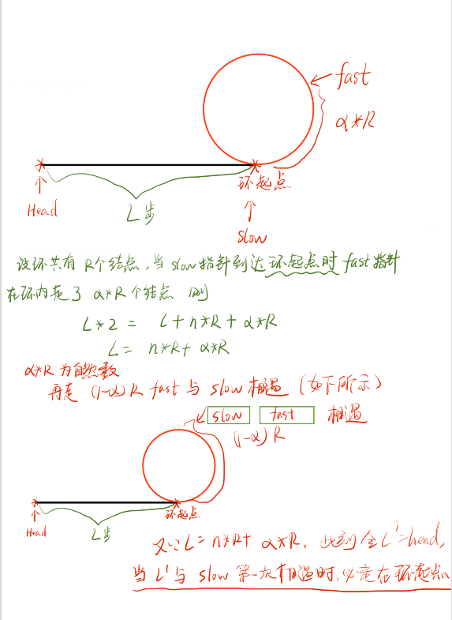

## 解决github不能显示图片的问题：
1. 首先登陆https://www.ipaddress.com/ 查询raw.githubusercontent.com
2. 假设查询结果为：**199.232.28.133**  修改C:\Windows\System32\drivers\etc\hosts文件，添加行：
   ```
   199.232.28.133 raw.githubusercontent.com
   ```
3. 保存之后，重新执行 git push -f


## 链表常见的各种操作
1. 获取倒数第k个元素-
2. 获取中间位置的元素
3. 判断链表是否存在环
4. 判断环的长度等和长度与位置有关的问题。
以上四个问题这些问题都可以通过灵活运用双指针来解决。
   [一文搞定常见的链表问题](https://leetcode-cn.com/problems/linked-list-cycle/solution/yi-wen-gao-ding-chang-jian-de-lian-biao-wen-ti-h-2/)
5. [判断环的起点问题](https://zhuanlan.zhihu.com/p/62918281)
   